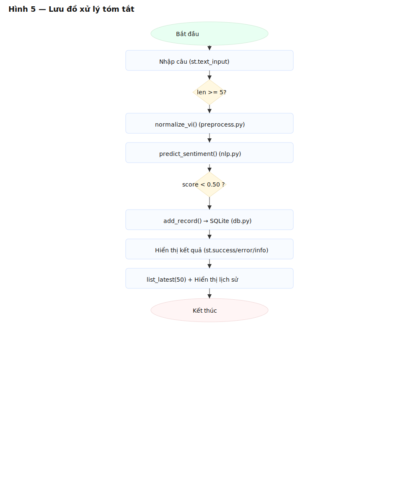
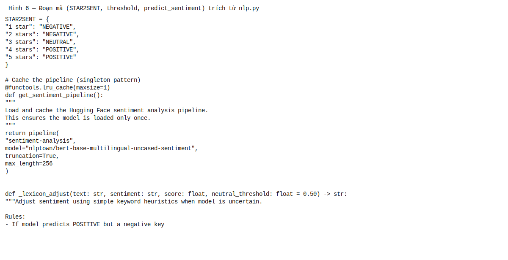
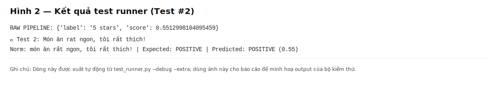
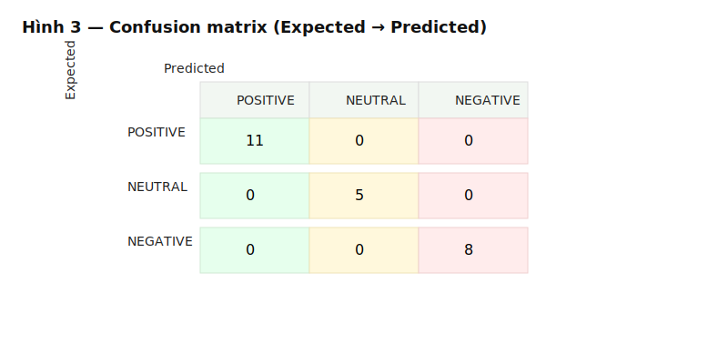

# Hướng dẫn chèn ảnh cho Phần 4 — GIẢI PHÁP (MÔ TẢ TRANSFORMER)

Tệp này hướng dẫn bạn chèn các hình đã tạo vào các mục 4.1–4.5 của báo cáo (file Markdown/PDF). Mỗi mục có đề xuất ảnh, caption và đoạn mô tả ngắn để copy/paste vào báo cáo.

---

## Ghi chú chung
- Các file ảnh đã tạo nằm trong thư mục `figures/` và `artifacts/`:
  - `figures/05_flowchart.svg` (flowchart tổng quan)
  - `figures/06_code_threshold.svg` (đoạn mã: STAR2SENT + predict_sentiment)
  - `figures/02_test_runner_case2.svg` (Test #2: RAW pipeline + mapped)
  - `figures/03_confusion_matrix.svg` (ma trận nhầm lẫn)
  - `figures/04_db_sample.svg` (mẫu 10 bản ghi DB)
  - `artifacts/test_case_2.txt` (dòng raw text cho Test #2)
  - `artifacts/db_sample.csv` (CSV 10 bản ghi)

- Nếu bạn cần PNG thay vì SVG, dùng công cụ (ví dụ ImageMagick) hoặc chụp màn hình SVG mở bằng trình duyệt.

  Ví dụ chuyển SVG → PNG (nếu có `magick`):

  ```powershell
  magick convert figures/05_flowchart.svg figures/05_flowchart.png
  ```

---

## 4.1 Ngôn ngữ và công nghệ
- Ảnh: không bắt buộc. Chèn bảng `requirements` hoặc `README.md` thay vì ảnh.
- Text gợi ý (copy vào phần 4.1):

  > Ngôn ngữ: Python 3.8+. Thư viện chính: `transformers` (≥4.35), `torch` (≥2.0), `streamlit` (≥1.28), `pandas` (≥2.0), `underthesea` (≥1.3), và SQLite (tích hợp sẵn). Chi tiết cài đặt có trong `README.md`.

---

## 4.2 Kiến trúc Transformer
- Ảnh đề xuất: (nếu có ảnh kiến trúc BERT) hoặc để phần mô tả chữ.
- Nếu bạn muốn minh hoạ, chèn `figures/05_flowchart.svg` ở cuối mục này (hoặc ngay phần 4.3) để liên kết kiến trúc model với pipeline.

  Caption gợi ý:

  > Hình X — Sơ đồ kiến trúc BERT (bert-base) sử dụng trong pipeline (12 layers, hidden_size=768, ~110M tham số).

---

## 4.3 Nguyên lý hoạt động
Đây là phần chính nên chèn nhiều hình minh hoạ để người chấm dễ hiểu luồng xử lý.

- Ảnh 1 (flowchart): `figures/05_flowchart.svg`
  - Caption: **Hình 5 — Lưu đồ xử lý:** từ nhập liệu → tiền xử lý → dự đoán → threshold → lưu/hiển thị.
  - Mô tả (copy):

    > Hình 5 minh họa luồng dữ liệu chính trong ứng dụng. Sau khi nhập câu, hàm `normalize_vi()` thực hiện tiền xử lý; kết quả được đưa vào pipeline BERT (cached pipeline) để dự đoán; nhãn ngôi sao được mapping sang POSITIVE/NEUTRAL/NEGATIVE; sau đó áp threshold (`neutral_threshold = 0.50`) và áp heuristics trước khi lưu.

- Ảnh 2 (code snippet): `figures/06_code_threshold.svg`
  - Caption: **Hình 6 — Đoạn mã (STAR2SENT, predict_sentiment)**.
  - Mô tả (copy):

    > Hình 6 trình bày đoạn mã xử lý mapping từ 'stars' sang sentiment và vị trí áp threshold (`neutral_threshold=0.50`). Những heuristics nhỏ (negation, gratitude, short-text override) được áp sau bước threshold để cải thiện kết quả cho các câu ngắn.

- Ảnh 3 (ví dụ raw → mapped): `figures/02_test_runner_case2.svg`
  - Caption: **Hình 2 — Ví dụ output test_runner (Test #2)**.
  - Mô tả (copy):

    > Hình 2 minh họa một ví dụ test cụ thể: raw pipeline trả `{'label':'5 stars','score':0.55}` và dòng mapped cho thấy kết quả cuối cùng là `POSITIVE`.

- Ảnh 4 (confusion matrix): `figures/03_confusion_matrix.svg`
  - Caption: **Hình 3 — Ma trận nhầm lẫn (Expected → Predicted)**.
  - Mô tả (copy):

    > Hình 3 trình bày ma trận nhầm lẫn trên bộ test đã chạy (bao gồm test mở rộng). Kết quả cho thấy độ chính xác và phân bố lỗi giữa các lớp.

---

## 4.4 Tối ưu hiệu năng
- Ảnh: `figures/04_db_sample.svg` (mẫu DB) — chứng minh lưu trữ lịch sử đúng định dạng.
  - Caption: **Hình 4 — Mẫu 10 bản ghi mới nhất trong bảng `sentiments`.**
  - Mô tả (copy):

    > Hình 4 minh họa các bản ghi đã lưu (id, text, sentiment, score, timestamp). Việc truy vấn chỉ lấy 50 bản ghi mới nhất (`ORDER BY id DESC LIMIT 50`) giúp UI phản hồi nhanh và tránh tải lớn.

- Thêm text (copy):

  > Để cải thiện thời gian phản hồi, pipeline được cache qua `functools.lru_cache(maxsize=1)`. Truy vấn DB tối ưu bằng `LIMIT` và index trên cột `id`. Các thao tác IO đều dùng parameterized queries để đảm bảo an toàn.

---

## 4.5 Xử lý ngoại lệ
- Ảnh: không bắt buộc; nếu muốn, chèn ảnh UI hiển thị lỗi (ví dụ chụp `st.error()`), hoặc bỏ qua.

  Mô tả (copy):

  > Ứng dụng kiểm tra đầu vào (>=5 ký tự) và bọc phần suy luận/lưu trữ trong try/except để hiển thị lỗi thân thiện nếu có sự cố. Các trường hợp lỗi sẽ không được lưu vào DB.

---

## Ví dụ cách chèn ảnh vào file Markdown

```markdown
### 4.3 Nguyên lý hoạt động



Hình 5 minh họa luồng...



Hình 6 cho thấy...



Hình 2 minh họa...



Hình 3 trình bày...
```

Lưu ý đường dẫn: điều chỉnh `../` tuỳ thư mục Markdown của bạn.

---

Nếu bạn muốn, mình có thể tự chèn các tag ảnh này vào tệp `docs/GIAI_THICH_LUU_DO.md` tại vị trí hợp lý (mình sẽ giữ bản text gốc và thêm các dòng `` theo mapping trên). Hãy trả lời "Chèn giúp" nếu muốn mình làm việc đó.
